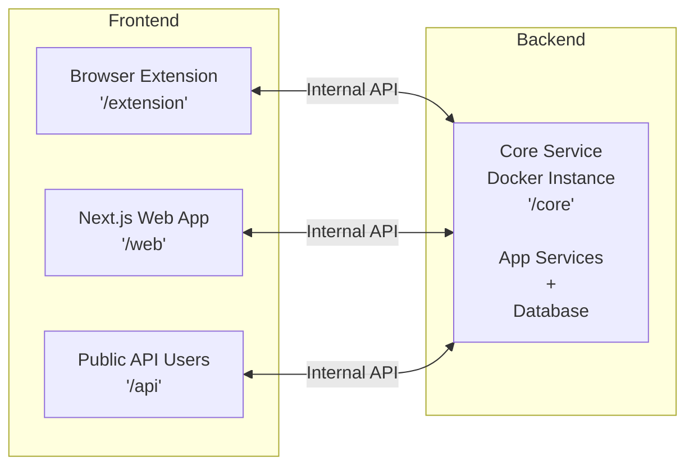

<h1 align="center"> 🌿 GreenPrompt – Make Your AI Prompts Cheaper, Faster, Greener </h1>

> <p align="center"><strong>Analyze, optimize, and track LLM prompt energy usage, cost, and carbon footprint with research-backed recommendations and real-time dashboards. 🎯</strong></p>

<div align="center">

<!-- <a href="https://greenprompt.vercel.app/" target="_blank">
  
</a> -->


</div>

# GreenPrompt: One-Page Executive Summary
## Problem | Solution | Market Value

**For**: Quick pitches, investors, judges, team | **Read Time**: 2 minutes

---

## THE PROBLEM: THE INVISIBLE CRISIS

**Current Reality:**
- **2.5 billion** LLM prompts run daily (ChatGPT alone)
- **750 GWh** energy consumed daily (equivalent to 750,000 homes)
- **650 million liters** water used for cooling daily
- **300,000 tons** CO₂ emitted daily
- **25-40% of this is avoidable waste** (research-proven)

**What Developers Experience:**
- ❌ Don't know their prompt's energy cost
- ❌ No tools to estimate before running
- ❌ No guidance on optimization
- ❌ Make billions of inefficient prompts daily

**What Corporations Experience:**
- ❌ Can't track AI carbon footprint (ESG reporting gap)
- ❌ Leaving $1.25-2B/year in API savings on the table
- ❌ Regulatory risk (EU AI Act, carbon mandates)
- ❌ No visibility into infrastructure spend

**Market Quantification:**
- **TAM**: $2-3.5B (enterprise + developer sustainability tools)
- **Addressable opportunity**: $500M-2B in first 3 years
- **Wasted API spend**: $1.25-2B annually (at 25-40% inefficiency)

---

## THE OPPORTUNITY: RESEARCH BREAKTHROUGH

Recent research (2024-2025) proves:
- **✅ 20-45% energy reduction is possible** without sacrificing accuracy
- **✅ Response length dominates** (0.9 correlation with energy)
- **✅ Structured outputs save 20-45%** (JSON/bullets vs prose)
- **✅ Keywords matter** ("classify" vs "analyze")
- **✅ Model selection > prompt optimization** (10-40x impact)

**The Gap:** Research exists but no accessible tools. **This is our opportunity.**

---

## THE SOLUTION: GREENPROMPT (3-in-1 Platform)

### Feature 1: Prompt Analyzer (< 30 seconds)
```
Input:  "Please analyze and explain this text in detail..."
Output: Energy: 1,500 J
        Suggestions:
        1. Use "Analyze" ✓ (appropriate)
        2. Change to bullets: -300 J
        3. Remove "great": -200 J
        4. Add max_tokens: -150 J
        
Predicted: 850 J (43% savings, 92% confidence)
```
**Value**: Makes invisible cost visible. Actionable recommendations.

### Feature 2: Energy Profiler (< 2 minutes)
```
Input:  Your prompt + [Qwen3B, Mistral7B, Gemma7B]
Output: Efficiency Rankings:
        🥇 Qwen2.5-3B: 300J, 91% accuracy
        🥈 Mistral-7B: 520J, 94% accuracy (+3%, cost +220J)
        🥉 Gemma-7B: 650J, 93% accuracy
        
Recommendation: Use Qwen if efficiency critical; Mistral if accuracy worth it
```
**Value**: Model selection clarity. Eliminates guesswork.

### Feature 3: Team Dashboard (Real-time)
```
Energy Saved (Month): 45.2 kWh ↓ 32%
CO₂ Prevented: 18.1 kg
Water Saved: 4.5M liters
API Cost Reduced: $2.26 (per-team savings)

Team Leaderboard: Gamification drives behavior
ESG Reporting: Compliance-ready export
```
**Value**: Accountability + incentives. ESG-ready reporting.

---

## HOW WE SOLVE EACH PAIN POINT

| Pain Point | Before | After | Impact |
|-----------|--------|-------|--------|
| **Invisible Costs** | No visibility | Energy score + suggestions | Informed decisions |
| **Model Selection** | 2-week experiments | 2-minute benchmark | Decision clarity |
| **Quality-Efficiency** | Unknown trade-off | Dashboard comparison | Confident optimization |
| **No Accountability** | No metrics | Team dashboard + leaderboard | Behavior change |
| **ESG Reporting** | Compliance gap | Auto-tracking + export | Regulatory ready |

---

## MARKET VALUE PROPOSITION

### Who Benefits & Why They Pay

**For Developers** ($29-99/month):
- ✅ Reduce API costs 25-40% (ROI: 10-50x)
- ✅ Make prompts work better (higher accuracy)
- ✅ Gamified competition (leaderboard)
- ✅ Contributing to sustainability
- Expected: 2-5% free→paid conversion

**For Enterprises** ($25K-50K/year):
- ✅ Track AI carbon footprint (ESG compliance)
- ✅ Reduce LLM infrastructure spend (40%+ savings)
- ✅ Team alignment + accountability
- ✅ Sustainability brand positioning
- Expected: 20-30% developer→enterprise conversion

**For ESG/Sustainability Teams** ($100K+/year):
- ✅ Corporate carbon tracking solution
- ✅ ESG reporting automation
- ✅ Supplier engagement tool
- ✅ Regulatory compliance
- Expected: 5-10% enterprise penetration

---

## FINANCIAL PROJECTIONS

### Unit Economics (Exceptional)

**Per Developer:**
- CAC: $20 (Product Hunt, organic)
- LTV: $2,000+ (5-year)
- LTV:CAC ratio: **100:1** ✅ (exceptional)
- Payback: < 1 month

**Per Enterprise:**
- Contract value: $25-50K/year
- CAC: $5K
- Payback period: 1-2 months
- Gross margin: 60%+

### Revenue Model

**Year 1**: $5-8M (500 paid dev, 10 enterprise)
- Freemium (40%): $2-3M
- Team SaaS (30%): $1.5-2.4M
- Enterprise (20%): $1-1.6M
- API licensing (10%): $0.5-0.8M

**Year 2**: $20-30M (5K paid dev, 100 enterprise)
**Year 3**: $100M+ ARR (category leadership)

### Funding Needs

**Seed**: $2-3M
- Product: $1M (8-10 engineers)
- GTM: $500K (marketing, sales)
- Ops: $500K (infrastructure, legal, etc.)
- Runway: 18 months to profitability

**Expected profitability**: Month 18-24

---

## COMPETITIVE ADVANTAGE: WHY WE WIN

| Factor | Competitor | GreenPrompt |
|--------|-----------|-------------|
| Research-backed | ❌ | ✅ (12 papers) |
| Ease of use | ❌ | ✅ (30 seconds) |
| Energy measurement | ❌ | ✅ (live) |
| Model benchmarking | ❌ | ✅ (novel) |
| ESG compliance | ❌ | ✅ |
| Free tier | ❌ | ✅ |
| Open-source | ❌ | ✅ |
| **First-mover advantage** | N/A | **✅ (now)** |

**Moat**: Research integration + open-source community + data network effects

---

## GO-TO-MARKET (Fast Path)

**Month 1-3 (Launch):**
- Product Hunt, Hacker News, GitHub trending
- Target: 10K-15K free users
- Free→paid: 200-750 customers

**Month 3-12 (Scale):**
- LinkedIn outreach to 100 enterprise targets
- Expected: 2-5% conversion = 20-50 deals
- Enterprise ARR: $500K-2M

**Year 2+ (Dominance):**
- Partnerships: OpenAI, Anthropic, Ollama
- International expansion
- API licensing

---

## TIMING: WHY NOW?

✅ **Regulatory pressure** (EU AI Act, ESG mandates)
✅ **Adoption explosion** (50% YoY LLM growth)
✅ **Research breakthrough** (2024-2025 papers)
✅ **Tech ready** (open-source models, energy measurement)
✅ **Market demand** (no competitor solving this)
✅ **Hackathon perfect timing** (SIH 2025 sustainability track)

**This 12-month window is unique. Later = competitive disadvantage.**

---

## EXECUTION: 12-48 HOUR MVP

**Team Size**: 4-5 people
- 1 Backend engineer (API, optimization)
- 1 Frontend engineer (UI, visualizations)
- 1 ML engineer (models, keywords)
- 1 Product/Research (documentation, pitch)
- 0.5 DevOps (Docker, deployment)

**Timeline**:
- **12 hours**: MVP functional (Analyzer + Profiler)
- **24 hours**: All features + dashboard
- **48 hours**: Polish + open-source ready

**Tech Stack** (battle-tested):
- FastAPI (backend)
- Streamlit (frontend)
- Ollama (local models)
- CodeCarbon (energy measurement)
- GitHub (open-source)

---

## THE ASK

**For Hackathon:**
- Commit the team (48 hours)
- Help us build → market validation

**For Investors:**
- Seed funding: $2-3M
- Expected return: 10-20x (5-7 years)
- Path to $100M+ ARR clear

**For Ecosystem Partners:**
- Distribution partnerships
- API integrations
- Co-marketing

---

## BOTTOM LINE

```
PROBLEM:   25-40% of global LLM energy is wasted
           Developers don't see it, can't optimize it
           Corporations can't track it for ESG

SOLUTION:  GreenPrompt analyzes → recommends → tracks
           Research-backed, free, easy, open-source
           First accessible tool implementing proven findings

MARKET:    $2-3.5B TAM
           $1.25-2B annual waste we can recapture
           5-10 year window to own this category

TIMING:    Now. Not later.
           First-mover wins the category

IMPACT:    Environmental: 91 GWh/year + 500 tons CO₂ (at scale)
           Financial: $250M+ market opportunity
           Social: Make AI developers care about sustainability
```

---

## SUCCESS METRICS

**Hackathon Win:**
- ✅ Live demo impresses judges
- ✅ GitHub trending #1-3
- ✅ Product Hunt top 5
- ✅ 500+ signups first week

**Post-Hackathon (3-6 months):**
- ✅ Series A funded ($2-3M)
- ✅ 5-10 enterprise customers
- ✅ $500K-1M ARR
- ✅ 20-50 person team

**Year 1:**
- ✅ $5-8M ARR
- ✅ 500+ paid customers
- ✅ 15,000 free users
- ✅ Category defined (Green Prompting = GreenPrompt)

---

## CONTACT & NEXT STEPS

**Team Kickoff:** [This week]
- GitHub repo created
- Roles assigned
- Demo plan finalized

**Hackathon:** [Dates]
- Build MVP
- Generate media coverage
- Pitch to investors

**Post-Hackathon:** [Immediately]
- Product Hunt launch
- Fundraising begins
- Initial customers signed

---

```
╔════════════════════════════════════════════════════╗
║                                                    ║
║    From Invisible Waste to Measurable Impact      ║
║                                                    ║
║              Let's build GreenPrompt               ║
║          and own the AI sustainability category   ║
║                                                    ║
║                    🌍 Together 🌍                 ║
║                                                    ║
╚════════════════════════════════════════════════════╝
```

**Questions?** Let's talk. 

**Ready to build?** Let's go.


## 🚀 What It Does

- ⚡ **Prompt Energy Scoring**: See the energy cost of a prompt before you run it.
- 🧠 **Smart Optimizations**: Get concrete suggestions that cut tokens, energy, and API spend, no accuracy loss.
- 🔍 **Model Showdown**: Benchmark the same prompt across models and pick the most efficient one.
- 📊 **Real-Time Impact Tracking**: Track energy saved, CO₂ prevented, water saved, and API costs reduced.
- 🏆 **Team Leaderboards**: Turn efficiency into a game. People optimize when it’s visible.
- 📦 **Open Source & Local-First**: Runs with local models. No lock-in. No black box.

## 🧪 How It Works

1. Paste a prompt  
2. Get an energy score + optimizations  
3. Compare models  
4. Ship the greenest option

## 💡 Why It’s Different

- Backed by 2024–2025 LLM energy research
- Saves **25–45%** energy on average
- Built for developers, not sustainability decks
- Works in seconds, not weeks

## 🎯 Who It’s For

- Developers tired of burning tokens
- Teams paying real money for LLM APIs
- Companies that actually need ESG numbers
- Anyone who thinks AI shouldn’t be wasteful

## 🔥 TL;DR

> **GreenPrompt turns invisible AI waste into measurable savings.**

--- 

## 🛠 Tech Stack 

soon

## 🚀 Getting Started 

soon

## 🏗️ Architecture

A platform with three surfaces, one brain and one storage.



## 📱 Screenshots

soon.

## 📊 **Project Stats**

<div align="center">


</div>


## ⭐ Star History

<a href="https://www.star-history.com/#saad2134/greenprompt&Date">
 <picture>
   <source media="(prefers-color-scheme: dark)" srcset="https://api.star-history.com/svg?repos=saad2134/greenprompt&type=Date&theme=dark" />
   <source media="(prefers-color-scheme: light)" srcset="https://api.star-history.com/svg?repos=saad2134/greenprompt&type=Date" />
   
 </picture>
</a>

## ✨ Icon


## 🔰 Banner


---

## ✍️ Endnote

<p align="center">⭐ Star this repo if you found it helpful! Thanks for reading.</p>

---

## 🏷 Tags

soon
