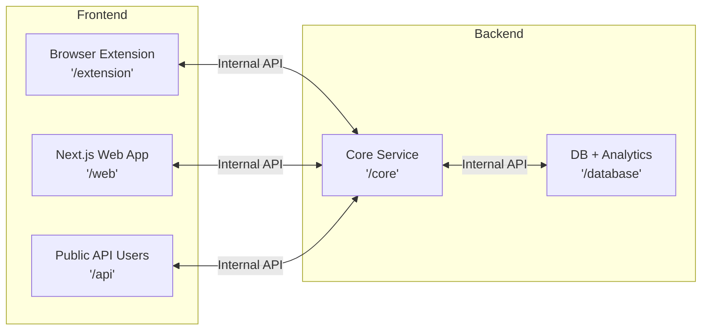

<h1 align="center"> 🌿 GreenPrompt – Make Your AI Prompts Cheaper, Faster, Greener </h1>

> 
<strong>Analyze, optimize, and track LLM prompt energy usage, cost, and carbon footprint with research-backed recommendations and real-time dashboards. 🎯</strong>

<!--  -->

Here’s a clean, short GitHub-ready section — no fluff, straight to the point.

## 🚀 What It Does

- ⚡ **Prompt Energy Scoring**: See the energy cost of a prompt before you run it.
- 🧠 **Smart Optimizations**: Get concrete suggestions that cut tokens, energy, and API spend, no accuracy loss.
- 🔍 **Model Showdown**: Benchmark the same prompt across models and pick the most efficient one.
- 📊 **Real-Time Impact Tracking**: Track energy saved, CO₂ prevented, water saved, and API costs reduced.
- 🏆 **Team Leaderboards**: Turn efficiency into a game. People optimize when it’s visible.
- 📦 **Open Source & Local-First**: Runs with local models. No lock-in. No black box.

## 🧪 How It Works

1. Paste a prompt  
2. Get an energy score + optimizations  
3. Compare models  
4. Ship the greenest option

## 💡 Why It’s Different

- Backed by 2024–2025 LLM energy research
- Saves **25–45%** energy on average
- Built for developers, not sustainability decks
- Works in seconds, not weeks

## 🎯 Who It’s For

- Developers tired of burning tokens
- Teams paying real money for LLM APIs
- Companies that actually need ESG numbers
- Anyone who thinks AI shouldn’t be wasteful

## 🔥 TL;DR

> **GreenPrompt turns invisible AI waste into measurable savings.**

--- 

## 🛠 Tech Stack 

soon

## 🚀 Getting Started 

soon

## 🏗️ Architecture

A platform with three surfaces, one brain and one storage.

## 📱 Screenshots

soon.

## 📊 **Project Stats**

## ⭐ Star History

<a href="https://www.star-history.com/#saad2134/promptonomics&Date">
 <picture>
   <source media="(prefers-color-scheme: dark)" srcset="https://api.star-history.com/svg?repos=saad2134/promptonomics&type=Date&theme=dark" />
   <source media="(prefers-color-scheme: light)" srcset="https://api.star-history.com/svg?repos=saad2134/promptonomics&type=Date" />
   
 </picture>
</a>

## ✨ Icon

soon

## 🔰 Banner

soon

---

## ✍️ Endnote

⭐ Star this repo if you found it helpful! Thanks for reading.

---

## 🏷 Tags

soon